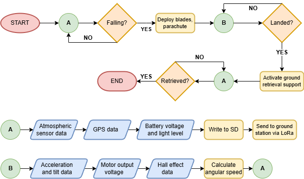
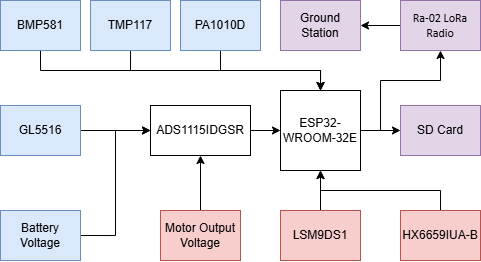

# ReSat
This repository contains all of the code used by the ReSAT Team taking part in the 2024/2025 European CanSat Competition.

## Hardware
This project will use two seperate microcontrollers: one onboard the CanSat and the other at the ground station.

### Onboard Computer
The onboard computer will be a costume-made PCB using the ESP-WROOM-32E it will be connected to the following peripherals:
* BME280 - temperature, atmospheric pressure, and air humidity sensor
* M10Q GPS QMC5883 - GPS module
* LSM9DS1TR - accelerometer, magnetometer, and gyroscope
* HX6659IUA-B - Hall effect sensor, used to determine the number of rotations of the parachute relative to the CanSat body
* ADS1115IDGSR - external analog to digital convertor, used to get more accurate digital conversions from both voltage dividers and the photoresistor
* Voltage dividers - two voltage dividers, used to determine the amount of energy produced by the motor and the battery energy level
* GL5516 - photoresistor, used to determine if the CanSat is in the rocket or outside
* Ra-02 - LoRa communication module, used to transmit data to the ground station
* TF PUSH - TF card reader, used to write data to the micro-SD card onboard
* Servo micro 9g - microservo, used to free the parachute compartment
* Buzzer 2700Hz - buzzer, used to help locate the CanSat after landing
* WS2812B (with 4 pixels) - LED strip, used to indicate the current mode of the CanSat

## Setup Process
This project was coded in Arduino IDE using the esp32 board library by Espressif (for a step-by-step setup process consult the link https://dronebotworkshop.com/esp32-intro/)

Libraries used:
* [BME280 by Adafruit](https://github.com/adafruit/Adafruit_BME280_Library/tree/master) 
* [u-blox GNSS by SparkFun](https://github.com/sparkfun/SparkFun_u-blox_GNSS_Arduino_Library) 
* [Soldered-LSM9DS1TR-Arduino-Library](https://github.com/SolderedElectronics/Soldered-LSM9DS1TR-Arduino-Library/tree/main)
* [Adafruit NeoPixel](https://github.com/adafruit/Adafruit_NeoPixel)
* [Adafruit ADS1X15](https://github.com/adafruit/Adafruit_ADS1X15)

## Software Architecture and Design
This project will consist of two main parts: 
1. The program which is to be executed by the onboard computer.
2. The ground station program.

### Onboard Software
Aims:
* Collect data from different sensors.
* Encode the data to an onboard micro-SD card.
* Transmit the data via Lo-Ra to the ground station.
* Ensure that the parachute compartment (along with the parachute and blades) is released via servo.

A is the low-power mode and B is the normal mode.

The blue components are inputs active for the entire runtime of the CanSat, data from the red sensors will only be collected while the CanSat is in normal mode, and the purple components are outputs.